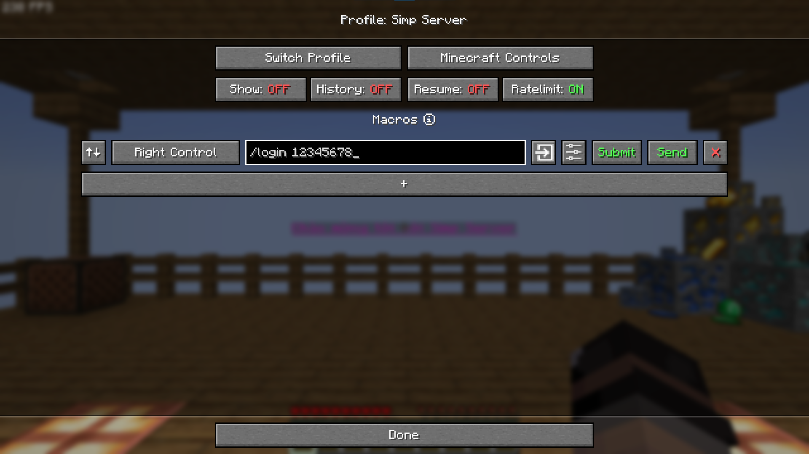

# HƯỚNG DẪN SETUP MINECRAFT CHO VTUBER.
***
### **NOTE 1**: ĐỌC TẤT CẢ CÁC CHÚ THÍCH QUAN TRỌNG.

### **NOTE 2**: HÃY CỐ GẮNG ĐỌC TẤT CẢ CÁC BƯỚC ĐỂ LÀM THEO. NẾU GẶP KHÓ KHĂN CÓ THỂ LIÊN HỆ ADMIN ĐỂ ĐƯỢC SUPPORT.

### **NOTE 3**: Tốt hơn hết hãy đọc qua file này trước ít nhất 1 lần trước khi thực hiện.

### **NOTE 4**: Kể cả khi bạn đã tự cài hoặc được một người khác cài đặt Minecraft giúp, hãy chắc chắn làm theo các bước dưới đây để tránh các vấn đề và sai sót không đáng có. Đối với các trường hợp không làm theo hướng dẫn này thì các Admin sẽ khó support hơn nên mong bạn hãy làm theo.

### **NOTE 5**: Nếu bạn đến link này từ trong server, bạn nên skip đến đoạn này: [CLICK HERE](#3-setup-minecraft-part-1) 
***
# Giới thiệu về Server:
***
Là một server Minecraft SMP đơn giản, được Group lập ra để làm nơi tương tác giữa các thành viên, các VTuber và các fan của VTuber với nhau.
### Các tính năng hiện có:
- Voice Chat trong game theo khoảng cách.
- Đĩa nhạc custom, sử dụng link Youtube. ==NOTE: Các bài hát này có thể khiến kênh của VTuber bị dính gậy bản quyền từ các nền tảng stream. Đọc kĩ cách xử lý ở phần dưới file.==
- TPA: Dịch chuyển tới toạ độ của người chơi khác.
- Death Chest: Khi chết, đồ của người chơi sẽ được giữ trong một rương đồ trong 3 phút.
- Hidden Armor: Ẩn giáp để hiện skin người chơi.
### LƯU Ý: Server chỉ hỗ trợ phiên bản 1.21.4
### IP: *node25156.mcviet.cloud:35156*
***
# Hướng dẫn setup Minecraft:
***
Để setup Minecraft, đầu tiên cần xác định bạn đã mua Minecraft chưa. Mỗi trường hợp sẽ cần sử dụng những launcher khác nhau.

Chưa mua game: Tôi recommend sử dụng [Legacy Launcher](https://llaun.ch/en).
Đã mua game: Có thể sử dụng [Minecraft Launcher](https://www.minecraft.net/en-us/download) hoặc [Prism Launcher](https://prismlauncher.org/download/windows/). Cá nhân tôi recommend sử dụng Prism Launcher thì tính tiện dụng trong giai đoạn setup sau.

Hướng dẫn cài đặt launcher được chia thành các mục theo từng launcher.

#### ***KHÔNG DÙNG TLAUNCHER TRONG MỌI TRƯỜNG HỢP!!!***
#### ***KHÔNG DÙNG TLAUNCHER TRONG MỌI TRƯỜNG HỢP!!!***
#### ***KHÔNG DÙNG TLAUNCHER TRONG MỌI TRƯỜNG HỢP!!!***
*Cái gì quan trọng nhắc 3 lần*

Vào cuối năm 2023, đầu năm 2024, TLauncher được xác nhận đã thực hiện các hoạt động sau:
- Chứa nhiều mã độc có thể thu thập dữ liệu người dùng.
- Chặn các trang web khác có liên quan tới Minecraft nhưng không liên quan tới công ty sở hữu TLauncher ở Nga.
- Chặn các server có quan hệ không tốt với công ty đằng sau launcher này.
Ngoài ra, công ty chủ của TLauncher cũng đã thực hiện các hành động kinh doanh như:
- Yêu cầu một (nhóm) lập trình viên viết riêng một launcher rồi đổi tên thành TLauncher, nhưng lại đánh bản quyền chính (nhóm) lập trình viên này sau đó (khi người này / họ phát triển một launcher khác tên `TLauncher Legacy` - chính là launcher gốc mà TLauncher dựa trên).
- Công ty từng tấn công và yêu cầu nhóm phát Terraria Launcher phải đóng cửa (dù launcher của họ là dành cho tựa game Terraria, không có liên quan gì tới Minecraft).
- Website `ru-minecraft.org` của công ty, sau này là `ru-m.org` và `en-minecraft.org` là trang được tạo ra để *bú fame* từ một trang web trước đó là `ru-minecraft.ru`.
- Công ty tiến hành đánh bản quyền bất cứ bên nào phát triển sản phẩm / phần mềm có cụm từ `TLauncher`.
#### VÀ HÃY NHỚ: TLAUNCHER LÀ MỘT LAUNCHER CRACK MINECRAFT. CÓ NGHĨA LÀ HỌ ĐANG LÀM TIỀN BẰNG CÁCH XÂM PHẠM BẢN QUYỀN CỦA CÔNG TY KHÁC.
***
## Lưu ý cho người chưa mua game: Bạn cần tạo tài khoản Ely.by để có thể dùng skin.

Truy cập [Ely.by](https://ely.by/) để tạo tài khoản bằng cách chọn nút **Create Account**.

Chọn nút **Join** ở góc trên bên phải:

Nhập nickname, email, password (2 lần) và xác minh để tạo tài khoản (nhớ tích và **I agree with terms of service**). Cuối cùng chọn **Register**.

Xác minh email: Kiểu tra email để nhập mã được Ely.by gửi về, nhớ kiểu tra cả thư rác. Xong rồi chọn **Confirm E-mail**.

Tích vào **I accept Ely.by terms of use** và **Activate Account**.

Vậy là đã có tài khoản Ely.by. Tiếp theo cần set skin cho tài khoản.
Truy cập [Ely.by/skins](https://ely.by/skins):

Chọn một skin bạn muốn dùng và chọn **Put On**. Vậy là được.

Trong trường hợp bạn không tìm thấy skin ưng ý, bạn có thể update skin của riêng bạn lên bằng nút **Add Skin** ở góc trên bên phải.

***
## 1. Cài đặt Java:

Để cài đặt Java, truy cập [link](https://adoptium.net/temurin/releases/?os=windows&arch=x64&package=jdk&version=21) để tải bản build Java Eclipse Temurin 21 của Adoptium, hãy lựa chọn định dạng file .msi để dễ dàng hơn trong quá trình cài đặt.
Sau khi tải thành công, tiến hành chạy file .msi:

Chọn **NEXT**.

Tích và nút **I accept the terms in the License Agreement** rồi chọn **NEXT**.

Chọn **Install for all users of this machine**, rồi chọn **NEXT**.

Click vào ô vuông trước dòng **JDK with Hotspot**, chọn dòng **Entire feature will be installed on local hard**, sau đó chọn **NEXT**.

Chọn **Install**.

**Lưu ý**: Nếu Windows yêu cầu quyền Admin, chạy chọn **YES**.
Đợi và chọn **Finish** để hoàn tất quá trình cài đặt Java.

## 2. Cài đặt Launcher:

Tuỳ theo tình hình thực tế, bạn có thể lựa chọn Legacy Launcher, Minecraft Launcher hoặc Prism Launcher.
### 2.1. Minecraft Launcher (Không recommend cho người đã mua game vì quá trình cài đặt không ổn định, người chưa mua game không thể dùng).
Đầu tiên, truy cập [link](https://www.minecraft.net/en-us/download) để tải Minecraft Launcher.

Chạy file `MinecraftInstaller.exe`

Ngồi đợi...
Quá trình này có thể mất khá lâu. Khi cài đặt cũng có thể yêu cầu quyền Admin, hãy cấp quyền cho nó.

Nếu vì một lý do nào đó mà bạn không cài được Minecraft Launcher, hãy quay trở lại link trên và chọn **Download Windows Legacy Launcher**, chạy file `MinecraftInstaller.msi`, rồi next cho tới bước tiếp theo.

Khi hiện thế này là đã cài đặt thành công. Bấm **Let's Go** để tiếp tục.

Tiến hành login vào tài khoản Microsoft đã mua game.

Tích vào nút **Microsoft apps only**

Chọn **Let's Go** để vào launcher. Đợi một lúc để launcher tải dữ liệu.

Nếu xuất hiện thông báo này, hãy bấm **Close**.

Vậy là bạn đã cài đặt xong Minecraft Launcher. Hãy đọc tiếp để biết các bước setup sau.
***
### 2.2. Legacy Launcher (Recommend cho người chưa mua game)

Truy cập [Legacy Launcher](https://llaun.ch/en), chọn **Download** để tải file cài đặt.

Chạy file `LegacyLauncher_Installer_legacy.exe`. **OK** và **Next** tới cùng.
**Lưu ý:** Chọn ngôn ngữ là tiếng Anh sẽ dễ dàng hơn trong việc nhận được support từ Admin.

**Finish** để hoàn tất.

Sau khi Legacy Launcher mở lên, hãy chọn **Create and Manage accounts**

Chọn dấu *cộng* bên trái, rồi chọn **Ely.by skin system**

Chọn **Log in to Ely.by** và **Open your browser**.

Chọn account mà bạn đã tạo trước đó.

Chọn **Approve**

Như vậy là đã đăng nhập thành công, trình duyệt sẽ hiện thị như sau.

Còn Launcher sẽ xuất hiện tài khoản của bạn, hãy chọn nút *ngôi nhà* về về màn hình chính.

Vậy là xong. Đọc tiếp để tới phần setup sau.
***
### 2.3. Prism Launcher (Recommend cho người đã mua game, người chưa mua game không dùng được)

Truy cập [link](https://prismlauncher.org/download/windows/) và chọn **Installer (.exe)** để tải file cài đặt.

Chạy file `PrismLauncher-Windows-MSVC-Setup.exe`, rồi **Next** đến cùng. Trong quá trình cài đặt, Prism Launcher sẽ cài cả Visual Studio Runtime cho bạn. Nếu xuất hiện thông báo quyền Admin, hãy đồng ý với thông báo đó.

**Finish** để hoàn tất.

Chọn tiếng Anh **American English** (dễ dàng hơn trong quá trình support) rồi chọn **Next**

Tuỳ chỉnh **Icons**, **Widget** và **Cat** theo ý của bạn rồi chọn **Next**

Chọn **Add Microsoft Account** để đăng nhập vào tài khoản Microsoft đã mua game.

Chọn **Sign in with Microsoft** để mở cửa sổ trình duyệt.

Đăng nhập vào tài khoản Microsoft của bạn:

Nếu trình duyệt của bạn hiện thông báo như thế này, hãy chọn **Open Prism Launcher**

Đợi một chút để Prism Launcher vào được tới màn hình chính này, vậy là xong.

***
## 3. SETUP MINECRAFT (Part 1)

Phần này sẽ hướng dẫn mọi người setup những cài đặt bên ngoài game, nhưng cần thiết để game có thể hoạt động. Ngoài ra, để đảm bảo game có thể chạy mượt mà và ổn định, việc cài mod cũng sẽ được thực hiện ở đây.
Phần này tiếp tục được chia ra theo từng launcher.
***
#### ***KHÔNG DÙNG OPTIFINE!!!**
#### ***KHÔNG DÙNG OPTIFINE!!!**
#### ***KHÔNG DÙNG OPTIFINE!!!**
*Cái gì quan trọng nhắc 3 lần.*
Hiện nay, Optifine đã không còn open-source như trước, dẫn tới nhiều vấn đề về tính tương thích với các mod khác. Không chỉ vậy, hiệu năng mà Optifine mang lại hiện không còn đáng kể, thậm chí có thể tệ hơn cả Minecraft mặc định.

 **Ngoài ra, server sử dụng custom resourcepack không hỗ trợ optifine!!!**

#### ***KHÔNG DÙNG OPTIFINE!!!**
#### ***KHÔNG DÙNG OPTIFINE!!!**
#### ***KHÔNG DÙNG OPTIFINE!!!**
*Cái gì quan trọng nhắc 3, à không, 6 lần.*
***
### 3.1. Minecraft Launcher

Với Minecraft Launcher, đầu tiên bạn cần phải cài đặt Fabric Mod Loader. Truy cập [link](https://fabricmc.net/use/installer/) và chọn **Download for Windows** để tải file cài đặt.

Chạy file `fabric-installer.exe`, chọn tab **Client**, **Minecraft Version** là **1.21.4**, **Loader Version** hãy chọn số cao nhất có thể. Cuối cùng chọn **Install**.

Chọn **YES**.

Vậy là thành công cài đặt Fabric Loader.

Mở Minecraft Launcher, chọn **Minecraft: Java Edition**, chọn Tab **Installation**. Sau đó bấm nào nút 3 chấm bên cạnh `fabric-loader-1.21.4`, rồi chọn **Edit**:

Chọn **More Options** để hiện thị các tuỳ chọn nâng cao:

Chọn **Browse**. Lúc này hãy tìm tới thư mục `C:\Program Files\Eclipse Adoptium\jdk-21.0.6.7-hotspot\bin`, click vào file `javaw.exe` và chọn **Open** ở góc dưới bên phải.
Lưu ý, dòng `jdk-21.0.6.7-hotspot` có thể thay đổi theo phiên bản Java mà bạn cài đặt.

Tích vào ô **Skip Java runtime version check** để tránh các vấn đề không mong muốn.

Bây giờ, truy cập [Flags.sh](https://flags.sh/), mục Memory hãy chọn mức RAM mà bạn muốn Minecraft sử dụng, recommend 4GB. Sau đó copy phần được bôi đen:

Quay lại Minecraft Launcher, tại mục **JVM Arguments**, hãy xoá tất cả đi và paste phần được bôi đen vào. Sau đó chọn **SAVE** ở góc dưới bên phải.

Tiếp theo, mở thư mục game bằng các chọn vào nút **Open installations folder**.

Một cửa số Explorer sẽ mở ra:

Truy cập [link](https://github.com/itsh1r0/Minecraft-for-VTubers-Content-Creators) để tải modpack đã được admin tối ưu. Chọn **Code**, và chọn **Download ZIP**:

Mở file `Minecraft-for-VTubers-Content-Creators-main.zip`, copy file `options.txt`, `server.data` và 2 thư mục `config` và `mods`:

Paste những file vừa copy vào thư mục ban nãy:

Quay trở lại Minecraft Launcher, Chọn **Minecraft: Java Edition** và vào tab **Play**. Hãy chọn instance **fabric-loader-1.21.4** ở dưới.

Vậy là xong. Để mở game hãy bấm nút **Play**. Bây giờ bạn hãy đọc tiếp để biết các bước setup trong game.
***
### 3.2. Legacy Launcher

Đối với Legacy Launcher, bạn sẽ không cần phải cài Fabric Loader nữa, vì nó đã có ngay trong launcher rồi.

Ở màn hình chính của Legacy Launcher, hãy chọn với phiên bản **Fabric 1.21.4**:

Sau đó chọn vào nút **Preferences** *(3 dấu gạch ngang)* ở dưới cùng bên phải, rồi chọn **Launcher & Game Preferences**:

Tại dòng **Memory (RAM)**, chọn 4GB, sau đó chọn nút **Configure...** ở dòng **Java / JRE**:

Chọn **Custom**, chọn **Browse...**

Tìm tới file `javaw.exe` theo đường dẫn `C:\Program Files\Eclipse Adoptium\jdk-21.0.6.7-hotspot\bin` (Số phiên bản có thể thay đổi). Xong hãy chọn **Open**:

Mở [Flags.sh](https://flags.sh) và copy phần được bôi đen:

Quay lại của số **Java Settings**, tại dòng **Java arguments**, paste những gì đã copy vào. Dòng bên dưới (**Improved JVM arguments**) hãy chuyển sang **Disable**. Cuối cùng chọn **Done**.

Bỏ chọn **Suggest servers** ở góc dưới và chọn **Save**. Bây giờ hãy chọn biểu tượng *thư mục* ở bên trái (dưới chữ *Install and play*).

Một cửa số Explorer sẽ hiện ra:

Truy cập [link](https://github.com/itsh1r0/Minecraft-for-VTubers-Content-Creators) để tải modpack đã được admin tối ưu. Chọn **Code**, và chọn **Download ZIP**:

Mở file `Minecraft-for-VTubers-Content-Creators-main.zip`, copy file `options.txt`, `server.data` và 2 thư mục `config` và `mods`:

Paste những file vừa copy vào thư mục ban nãy:

Giờ hãy quay lại Legacy Launcher, chọn **Install and play** để tải dữ liệu cần thiết và vào game. Rồi nhớ đọc tiếp để biết việc setup ingame.

***
### 3.3. Prism Launcher
Ngl, Prism Launcher dễ dùng nhất trong cả đám rồi.

Chọn nút **Settings** ở thanh trên:

Vào mục **Java**, tab **General**. Ở dòng **Minimum Memory Allocation**, hãy set số GIỐNG với dòng **Maximum Memory Allocation**.

Chọn nút **Auto-detect...** Để chọn phiên bản Java có chữ *Eclipse Adoptium*:

Mở [Flags.sh](https://flags.sh) và copy phần được bôi đen:

Paste vào mục **JVM arguments**. Rồi giờ chọn **Close** để lưu settings.

Chọn nút **Add Instance** ở thanh trên:

*Từ đoạn này tôi đổi UI của Prism Launcher để dễ nhìn hơn*

Chọn phiên bản 1.21.4, bên dưới mục **Mod Loader**, chọn **Fabric** và chọn phiên bản cao nhất của Fabric. Click OK để tạo instance.

Chọn Instance **1.21.4** bạn vừa tạo, click nút **Folder** ở bên phải.

Một cửa số Explore sẽ hiện ra:

Chọn thư mục `minecraft`:

Truy cập [link](https://github.com/itsh1r0/Minecraft-for-VTubers-Content-Creators) để tải modpack đã được admin tối ưu. Chọn **Code**, và chọn **Download ZIP**:

Mở file `Minecraft-for-VTubers-Content-Creators-main.zip`, copy file `options.txt`, `server.data` và 2 thư mục `config` và `mods`:

Paste những file vừa copy vào thư mục ban nãy:

Quay trở lại Prism Launcher, chọn nút **Launch** bên phải để mở game.

***

## 3. SETUP MINECRAFT (Part 2)

Phần nãy sẽ hướng dẫn cài đặt Minecraft ingame.

### 3.1. Setting cơ bản

Mở game lên, nếu bạn thấy game bị giật giật thì hãy Alt-Tab ra rồi vào lại game.
Chọn **Options**.

Tại đây, hãy chỉnh thông số **FOV** cho phù hợp với bạn:

Ví dụ cho FOV cao:

Ví dụ cho FOV thấp:

Sau khi đã chỉnh FOV phù hợp, chọn mục **Controls**:

Để chỉnh độ nhạy chuột, vào **Mouse Settings**. Ở mục **Sensitivity**, tăng hoặc giảm độ nhạy chuột theo thói quen sử dụng của bạn. 

Trở lại mục **Controls**, chọn **Key Binds** để chính nút chuột và bàn phím:

Bạn có thể đối chiếu với các bảng sau để chỉnh nút cho phù hợp:

***CÁC NÚT DI CHUYỂN:***

| **Chức năng** |         **Nút**          |   Nơi chỉnh   |
| :-----------: | :----------------------: | :-----------: |
|     Tiến      |            W             | **Key Binds** |
|      Lùi      |            S             | **Key Binds** |
|   Sang trái   |            A             | **Key Binds** |
|   Sang phải   |            D             | **Key Binds** |
|     Nhảy      |     Space (nút cách)     | **Key Binds** |
|     Chạy      | Left Shift (Shift trái)  | **Key Binds** |
|   Cúi người   | Left Control (Ctrl trái) | **Key Binds** |

***CÁC NÚT CHUỘT:***

|  **Chức năng**  |                    **Nút**                     |   Nơi chỉnh   |
| :-------------: | :--------------------------------------------: | :-----------: |
| Phá / Tấn công  |            Left Botton (Chuột trái)            | **Key Binds** |
| Đặt / Tương tác |           Right Botton (Chuột phải)            | **Key Binds** |
|   Chọn Block    | Middle Button (Chuột giữa, nhấn con lăn xuống) | **Key Binds** |
|      Zoom       |          Button 4 (Nút hông bên dưới)          | **Key Binds** |

***CÁC NÚT INVENTORY***

|       **Chức năng**       |    **Nút**    |   Nơi chỉnh   |
| :-----------------------: | :-----------: | :-----------: |
|        Slot 1 - 9         | Các nút 1 - 9 | **Key Binds** |
|         Thả item          |       Q       | **Key Binds** |
|    Đóng / mở Inventory    |       E       | **Key Binds** |
| Chuyên item sang tay trái |       F       | **Key Binds** |

***CÁC NÚT KHÁC***

|                  **Chức năng**                   |            **Nút**             |       **Nơi chỉnh**       |
| :----------------------------------------------: | :----------------------------: | :-----------------------: |
|                 Danh sách player                 |              TAB               |       **Key Binds**       |
|                       Chat                       |               T                |       **Key Binds**       |
|                    Viết lệnh                     |               /                |       **Key Binds**       |
|                    Thành tựu                     |               L                |       **Key Binds**       |
|           Chụp ảnh màn hình trong game           |               F2               |       **Key Binds**       |
|              Bật tắt full màn hình               |              F11               |       **Key Binds**       |
|                   Đổi góc nhìn                   |               F5               |       **Key Binds**       |
|                      Ẩn HUD                      |               F1               |       **Key Binds**       |
|                 Chỉnh Voice Chat                 |               V                |       **Key Binds**       |
|                   Chỉnh Macro                    |               K                |       **Key Binds**       |
|         Mute Mic Voice chat của bản thân         |               M                |  Thông qua Plasmo Voice   |
| Tắt Voice Chat (Không nói và không nghe được) |    Right Alt (Alt Phải)     | Thông qua Plasmo Voice |
|                 Dùng voice chat                  | Button 5 (Nút chuột hông trên) |  Thông qua Plasmo Voice   |
|                 Đăng nhập nhanh                  |   Right Control (Ctrl Phải)    |      Thông qua Macro      |

### 3.2. Chỉnh Voice Chat

Vào thế giới, nhấn **V**:

Chỉnh **Microphone** và **Output Device** thành Mic và Tai nghe (hoặc Loa) mà bạn muốn dùng cho voice chat.

Tại mục **Activation**:"

- Activation Type:
	- Push-To-Talk: Bấm giữ nút Button 5 để nói.
	- Voice: Chỉ cần nói to hơn một mức nhất định là được.

Tại mục **Hotkeys**

- Mute Microphone: Tắt mic
- Disable Voice Chat: Tắt voice chat (không nghe và không nói được).

**LƯU Ý**: Vì server cho phép mọi người custom đĩa nhạc bằng link Youtube, sẽ có nguy cơ VTuber và Content Creator khi stream sẽ bị dính bản quyền từ nền tảng phát trực tiếp. Để tránh trường hợp đó, cách tốt nhất là tắt âm thanh của đĩa nhạc custom.

Tại mục **Volume**, hãy kéo âm lượng của **Discs** về 0%.

### 3.2. Chỉnh Login nhanh.

Server sử dụng một hệ thống đăng nhập bằng tên người chơi và mật khẩu. Tuy nó khá tiện, so việc này có thể khiến VTuber hoặc Content Creator lộ mật khẩu tài khoản server khi vô tình nhập mật khẩu trên stream. Để tránh việc đó xảy ra, Admin đã tích hợp với Modpack cho VTuber / Creator mod Macro để có thể login nhanh, không bị lộ mật khẩu trên stream.

Đầu tiên, hãy vào server một lần (Trước khi stream):

Bây giờ, tiến hành đăng kí theo cú pháp:
`/register <mật khẩu> <nhập lại mật khẩu>` rồi *Enter*.
Ví dụ:

Khi có thông báo đăng kí tài khoản thành công, vậy là thành công tạo tài khoản trong server.

Bây giờ, nhấn **K** và điền mật khẩu bạn vừa dùng để tạo tài khoản tại server vào sau đoạn `/login`. Ví dụ:

Cuối cùng, chọn nút **Done** ở bên dưới để lưu lại. Sau này, chỉ cần bấm nút Ctrl Phải là đã có thể login mà không bị lộ mật khẩu rồi.
